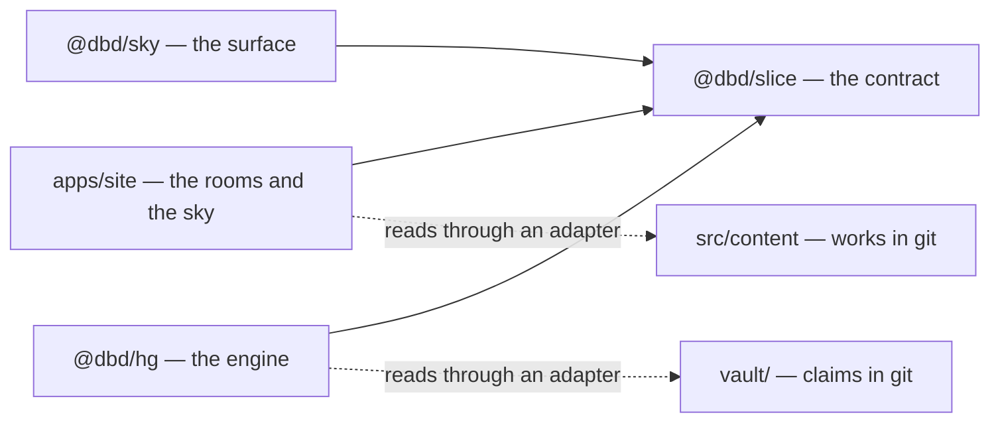

# Cathedrals

*The founding document of the workspace the house shares with the engine beneath it. Named 2026-09-03, with Danny, after he set a second repository beside this one and said: there are cathedrals everywhere for those with eyes to see. Downstream of [CLAUDE.md](./CLAUDE.md) (the soul), [DOMAIN_MODEL.md](./DOMAIN_MODEL.md) and [GRAPH_AND_LINKING.md](./GRAPH_AND_LINKING.md) (what the rooms hold and how works connect), [REACT_NORTH_STAR.md](./REACT_NORTH_STAR.md) (the axioms), [RENDERING_STRATEGY.md](./RENDERING_STRATEGY.md) (the static stance and its triggers), and [CONSTELLATION_ARCHITECTURE.md](./CONSTELLATION_ARCHITECTURE.md) (the sky's pure core). It sits on the grounds. The ground under the house turned out to be shared.*

*The movements from "What Is Preserved" through "How the Agent Works Here" are written to become the root `CLAUDE.md` of the workspace when the site moves under `apps/`. Until then the site's `CLAUDE.md` remains the entry, and this file is read after it.*

---

## The Image

A cathedral is one building made of rooms that do not know they are separate. The nave is where people walk. Overhead is the vault — the arched ceiling — and the word is not a coincidence: a vault is also where what must endure is kept. The sky at `/sky` is drawn on the ceiling. The vault of claims beneath the engine is where the drawing's truth is kept. They are the same vault, seen from inside and from below.

Danny built two things without a wall between them. The house is this repository: five rooms, eight facets, a sky that is walked. The engine is `cathedrals`: a knowledge graph whose constitution is one sentence long — *agents propose; the author blesses.* The house grew from a sentence about containers: he builds rooms where others become more themselves. The engine grew from three operations its manifesto calls the knife, the thread, and the vessel — differentiation, relation, persistence. Read side by side, they are the same three. A container is a differentiation that holds. A facet is a thread. The enough is a persistence that knows when to stop.

Both grew from a third repository: the Living Graph of December 2025, `living-graph`. The engine kept its constitution. The house kept its design brief. The sky kept its constellation and set down its canvas. And the Living Graph grew from a fourth, the oldest: Dyerverse, 2025, where the longing, the seven entities of a golden loop, and the creed of pure functions first appear — without yet the consent the three later ones share. Phase 3 brings both in as lineage. The whole is Dyerverse; this document keeps the image it was named for.

This document does not merge them. It names the ground they stand on, draws the wall they share, cuts one door through it, and says which builder keeps which keys.

---

## What Is Preserved

Nothing that either project earned is given up. The tables name what each keeps, as written, and the file that holds it.

### From the house

| Kept | Where it lives |
|---|---|
| The soul: containers, spanda, the enough, the rooms as lenses | `CLAUDE.md` |
| Pure static output with no production runtime, and the async barrel as the seam that keeps the door open | `RENDERING_STRATEGY.md` |
| The fourteen axioms, the thresholds, the atomic hierarchy, the dependency direction law | `REACT_NORTH_STAR.md` |
| A pure core in a thin shell: time as an argument, events as data, the rim named file by file | `CONSTELLATION_ARCHITECTURE.md` |
| The walk: volitional travel, the compass, figures as spanning trees, presence, the whisper | `CONSTELLATION_WALK.md` |
| The material: umber, paper grain, two serifs, slow motion, dark mode as a room dimming | `DESIGN_SYSTEM.md`, `INTERACTION_DESIGN.md` |
| The site's voice, kept distinct from Danny's | `VOICE_AND_COPY.md` |
| Specs as the reference layer, skills as the orientation layer, the site publishing its own making | `SPECIFICATION_MAP.md`, `TRANSPARENCY.md` |
| The lint rims: the FP selectors, the boundaries, the shape check, the 80-line ceiling | `eslint.config.js`, `scripts/` |

### From the engine

Named, not linked: these files live in the `cathedrals` repository until it enters the workspace (Phase 2).

| Kept | Where it lives |
|---|---|
| The covenant: author sovereignty is absolute; agent-originated canonical change passes through `pending` with `decision = NULL` until blessed or rejected | `AGENTS.md` |
| The constitution: the body is primary, relations are first-class, triple addressing, the system sees itself, emergence is earned, the embedding is not the body | `docs/foundations/CONSTITUTION.md` |
| The five primitives — identity, content, reference, time, suspension — the six constraints, the nine operations | `docs/foundations/AXIOMS.md` |
| The three origins — declared, discovered, emergent — immutable once written | `src/domain/types/relation.ts` |
| The event log and the decision log; replay by step; typed errors; deterministic tests behind invariant ids | `src/`, `.agent/INVARIANT_CASES.md` |
| The hexagonal seams: domain, ports, adapters, with Effect inside the application layer | `src/domain`, `src/ports`, `src/adapters`, `src/app` |
| Thirty-two decisions, among them the attention field that is never persisted (23), blessing as inline review (24), typing as an `is_a` relation (30), and structural isomorphism as a protected attribute (32) | `docs/architecture/DECISIONS.md` |
| The protocol: load a bounded slice, propose, await, resolve, step through events | `docs/architecture/GRAPH_PROTOCOL.md` |
| The vault: atomic claims with prose titles, eight constellations, metabolic states, sixteen verbs, the git log as the event log | `vault/`, `.claude/skills/` |
| The taste: readability first, red-green-refactor, milestone commits, a stopwatch on every seam, a high appetite for refactoring | `.agent/TASTE_PROFILE.md` |
| The anti-cathedral rules: nothing becomes a canonical node unless it changes behavior; compost weekly | `docs/architecture/PRAXIS_GRAPH_OS.md` §9 |

### From both

Both projects arrived, separately, at hexagonal architecture, at pure domains with framework-free types, at a schema at the boundary, at documents upstream of code, and at consent as structure rather than as a dialog: the house publishes its own making in `TRANSPARENCY.md`; the engine writes the origin of every edge. Where they agree, nothing needs deciding.

### What neither wrote down

The practice that produced the walk and the sky's pure core is recorded nowhere but in the agent that did it. "How the Agent Works Here," below, writes it down.

---

## What Is Blended

Blending is the only place this document spends decisions. Each is made here once; the files on either side keep their own words.

### One thing, two registers, never a third

The engine names what a thing *is*. The sky names what it *looks like*. Nothing in the workspace introduces a third name for a thing that already has two.

| The engine says | The house says | The sky draws | The same thing |
|---|---|---|---|
| entity, with a body | work, with a body | star | A particular that is its own text. The body is primary in both constitutions; the slice never carries what a body does not. |
| archetype — a lens for viewing, not a category for sorting (Article VI) | type — influences rendering, never routing | the star's mark (held) | The kind of thing, worn lightly. |
| — | room — the home a work lives in; rooms are lenses, not silos | — | The engine has no room. The slice carries it as `group`, optional, so the house loses nothing and the engine invents nothing. |
| constellation — a map of content in the vault; `is_a` targets in the engine | facet — a dimension of Danny that cuts across rooms | the compass: a bearing, a hue, a figure | An **axis**. The slice carries axes with azimuths. The site's eight facets are one compass; the vault's eight constellations are another. |
| relation — subject, predicate, object, origin | wikilink, backlink | thread | The thread. Declared, discovered, or emergent. |
| `pending`, with `decision = NULL` | — | a ghost: a star not yet lit, where it would land if blessed | The suspension. Visible before it is actionable. |
| aperture; focus levels foreground, midground, background, hidden | — | presence: here, near, far, the cap, the two strangers | One pure function of hops, resonance, and a threshold. |
| the focused entity; the attention field, never persisted (Decision 23) | — | `here`; the walk's memory in session storage | Present tense, not history. The house already keeps it exactly as the engine decided. |
| the inspector panel; the blessing card with evidence and confidence | — | the whisper | One voice, second person, a paragraph each. |
| `resonates` — the soft edge, never canonical | concordance neighbors | the concordant whisper line | Noticed, never blessed as itself. |
| space — an ownership and policy boundary | the site, one author | one sky | The site is one `author_canonical` space. The vault is a second space, about the first. |
| the event log, stepped | git history | the trail | The vessel. See "Git Is the Vessel." |

The sky already draws all three origins and names none of them. Figures — the spanning trees over each facet's stars — are emergent structure the system noticed. Wikilinks between works are declared structure the author wrote, and the sky does not draw them today. Concordance is discovered structure awaiting a blessing that has no verb yet. Phase 1 gives the sky the words: declared threads drawn, emergent figures kept, discovered candidates whispered.

### Adjudications

Where the two disagree, one side wins, and the reason is written.

1. **The sky is the interface; the interface contract is superseded.** The engine's `docs/contracts/UI_SPEC.md` specifies a dark dashboard: monospace labels, fast transitions, an inspector panel, a force-directed graph. Its own first section says the constellation is a place to think, not a dashboard to monitor. That sentence is the whole premise of the house, and the sky already keeps it. The aperture mathematics in its §6 and the node-count thresholds in its §15 survive — as the shared presence function and as the trigger for the high-node-count strategy already held in `CONSTELLATION_IMPLEMENTATION_PLAN.md`. The rest of that file is compost.
2. **The predicate vocabulary is closed.** The engine holds three vocabularies at once: eight predicates in code, an open set in one vault claim, some two dozen controlled verbs in its Praxis document. The slice takes the eight in code, plus `resonates` as the one soft predicate that can never be declared. A predicate is added by a decision record, never by an adapter.
3. **Origin is drawn; predicate is spoken.** A thread has room for two structural dimensions before it becomes noise: its axis, as hue, and its origin, as stroke. The predicate belongs to the whisper. This collides with the sky's present use of dotting to separate the two facets that share a hue. The collision is held, below.
4. **Test-first and spanda are not in tension.** The engine's taste is red-green-refactor, invariant ids first, a stopwatch on every seam. The house's practice is to wait for the tremor. One answers *how* a change is made; the other answers *whether, and when*. The workspace keeps both: invariants and tests before code, once the pull is real.
5. **Canon stays canon; narrative stays narrative.** The engine's documentation is long, and much of it describes a future it has not built — durable streams, workflows, a real-time attention field, a rich-text editor. Its own `DOCS_ARCHITECTURE.md` already sorts contracts from narratives. The workspace honors that sort and adds no layer of its own. This document is grounds for the engine, not canon; when it changes an engine obligation, the change is recorded in the engine's `DECISIONS.md` first.
6. **The anti-cathedral rule applies to this document.** Nothing here becomes a package, a type, or a spec unless it changes what the site or the engine does. Every phase below names the behavior it changes.

---

## The Shape

A pnpm workspace, which this repository already is. Today the site lives at the root and `packages/` holds the sky's re-export shim. The workspace grows by packages, and the site moves under `apps/` only when something else needs the root (Phase 4).

```
dyerverse/                    the workspace: the site's repository, renamed when Danny says so
├── CLAUDE.md                 the soul; then this document's movements, when the root is free
├── apps/
│   └── site/                 danielbdyer.com, the rooms and the sky (at the root until Phase 4)
├── packages/
│   ├── slice/                @dbd/slice: the contract that crosses the wall (types, schema, invariants)
│   ├── vault/                @dbd/vault: reads an ars-contexta vault into a slice (the book's claims, first)
│   ├── sky/                  @dbd/sky: the surface (a shim today; the pure core moves in with a second consumer)
│   └── hg/                   @dbd/hg: the engine, entered by subtree with its history (Phase 2)
├── vault/                    the claim vault: markdown in git, imported by no code, read through an adapter
├── .claude/skills/           the house's five outcomes; the vault's sixteen verbs (held: fold them into one outcome)
└── pnpm-workspace.yaml
```

### The dependency direction law



- The site and the engine both depend on the contract. Neither imports the other. Nothing imports `apps/*`.
- The contract depends on nothing but TypeScript and zod. Effect never crosses it. React never crosses it.
- Data — works and claims — is markdown in git, imported by no code, read through adapters that produce a slice.

### Dependency injection, without a container

Both codebases already practice inversion: the engine through Effect's `Context.Tag` and layers; the house through the async barrel, whose implementation is synchronous today and whose signature is the seam. The workspace adds no container. A port is a TypeScript interface in `@dbd/slice`; an adapter implements it at an edge; the top of each program wires them.

| Port | Adapters | Composition root |
|---|---|---|
| `GraphSource` — produce a `Slice` for a space, later for an aperture | the works adapter in the site; the vault adapter and `hg slice` in the engine | the site's build: the barrel picks the source. Today `import.meta.glob`; tomorrow a slice the engine emits before `vite build`. |
| `Consent` — `propose`, `pending`, `resolve` | none in the static site, where the verbs are absent and the ghosts are visible; the engine's protocol over a Worker (Phase 5) | the `/sky` route, which hands the port to the shell as an argument |

Inside the engine, Effect layers keep doing what they do. The contract is the only place the two inversions meet, and it is plain data.

---

## The Contract: The Slice

What crosses the wall is a **slice** — the engine's own word for a bounded view of the graph loaded for one turn (`graph.slice.load` in its protocol). A slice is plain JSON with a zod schema of record in `@dbd/slice`. It carries:

| Field | What it holds |
|---|---|
| `space` | The space the slice was cut from. The site is one space. |
| `asOf` | When it was cut. Time is an argument. |
| `axes` | The compass: an id, a name, an azimuth in degrees, an optional hue. The site's eight facets; the vault's eight constellations. |
| `nodes` | Entities: id, title, kind, axes, an optional summary, `createdAt`, an optional metabolic status, an optional `href`, an optional `group`. No body. The body is primary and stays at home. |
| `edges` | Relations: subject, predicate, object, origin, an optional weight. |
| `pending` | The count of unresolved proposals, and the ghosts the sky may draw: a proposed entity or relation with its confidence and evidence. |

### Invariants

- **INV-SLC-001 — every edge is grounded.** Subject and object name nodes in the slice. The engine's constraint C3, carried across the wall.
- **INV-SLC-002 — every axis is named before it is used.** A node's axes name axes in the slice.
- **INV-SLC-003 — a resonance is never declared.** `resonates` carries origin `discovered` or `emergent`, never `declared`.
- **INV-SLC-004 — a ghost is not a node.** Proposals live in `pending`. A ghost becomes a node only by blessing, in the source, and arrives as a node in the next slice.
- **INV-SLC-005 — figures are derived, never carried.** The spanning trees the sky draws over an axis are computed by the view from axes and placement. A slice carries relations, not figures.

The schema enforces the first three. The adapters' tests hold the last two.

### What the sky derives from a slice

Placement from axes, exactly as `placeWork` does from facets today. Figures from axes and placement. Threads from edges: declared solid, discovered dotted, emergent hairline, with the predicate spoken by the whisper. Bearings from edges and figures. Presence from hops and resonance under a cap. Ghosts from `pending`, drawn where they would land and lit only by attention. Nothing else.

---

## Git Is the Vessel

The engine's constitution says content is the exclusive source of truth and every derived thing is recomputable. The house says the same in `CONTENT_SCHEMA.md`: a work is a markdown file with frontmatter, and every listing, graph, and page is derived from it at build time. The vault says it outright: the event log is the git log; blessing a proposal creates a commit. All three already agree on where truth lives.

The workspace takes them at their word. For the site's graph, **markdown in git is canonical**. Works and claims are the same kind of thing — a body, a frontmatter, wikilinks — and the engine reads both through adapters into its in-memory graph at build time. The engine's SQLite tables are the index of that truth for the site, rebuilt from it. They remain canonical for the engine's own deployments, where agents work in spaces of their own and replay by step is the stronger provenance. The slice makes the two substrates interchangeable, which is Decision 32 made real.

This settles the runtime question for now. The site stays static. Blessing happens where it already happens: `hg bless` in the terminal, a commit, a push, a rebuild. The sky shows the ghost before and the star after. A web verb for blessing is request-time behavior in the page — the second of the two triggers `RENDERING_STRATEGY.md` names for a runtime — scoped to a single route, and it is held (Phase 5) until Danny wants to bless from a phone or a second author appears.

The tradeoff is named plainly: git history is weaker provenance than a stepped event log with decision rows, and stronger inspection. For one author writing in one repository, inspection wins.

---

## The Engine's Successor: Preferences

Danny asked for the successor to be driven by preference, not by attachment to detail. These are the preferences, each with its reason. None is a rewrite.

1. **Keep Effect inside the engine.** Typed errors, layers, and streams earn their keep in the intake pipeline and the consent loop. Effect never crosses the contract, so the site never pays for it. When a file that imports `@effect/schema` is touched, it moves to `effect/Schema`, where the module now lives.
2. **The contract is TypeScript and zod, and nothing else.** Zod is already the house's schema of record. The engine validates its own outputs with its own schema, and the slice with the slice's. One schema of record per boundary, never two.
3. **No rewrite for taste.** The engine's ten thousand lines and seventy-five test files are preserved as they stand. They enter the workspace by `git subtree add` from Danny's repository, history intact — never from a snapshot. The taste profile's own rule governs: do not fragment the system to satisfy purity aesthetics.
4. **Closed vocabularies.** Eight predicates plus `resonates`; three origins; five metabolic states. Extended by decision record only.
5. **Each package keeps its own rim.** The house's FP selectors and boundaries apply in full to `@dbd/slice` and to the site. The engine keeps its architecture tests as its boundary proof; the FP selectors run over it as warnings until a decision promotes them. A rim is named file by file, never a lifestyle.
6. **Invariant ids cross the wall.** The contract's invariants carry `INV-SLC-*` ids in the engine's ledger style, each with a test.
7. **Maximum strictness everywhere.** The root `tsconfig.json` already holds it. Packages extend it and add nothing.
8. **pnpm workspaces, and nothing more, until the trigger.** A task runner with caching arrives when a full build crosses a minute or a second app exists.
9. **Deployment does not change.** The site remains static assets served by Workers Builds. The engine, when it runs in the cloud, is its own Worker with its own D1, on its own route or zone.
10. **Names.** The scope is `@dbd/`, Danny's initials. It was `@dby/` when the sky package was extracted; he corrected it when he blessed this document. `@dbd/slice` for the contract, `@dbd/sky` for the surface, `@dbd/hg` for the engine, whose CLI is already `hg`. The workspace is Dyerverse — the name Danny gave the whole of himself online in 2025, agreed 2026-09-03 — from the day he renames the repository; GitHub keeps the old address. `@dbd/hg` is still his to bless.

---

## How the Agent Works Here

This movement speaks to the agent directly, as `CLAUDE.md` does, because it is written to be loaded as instructions. It records the practice that built the walk and the sky's pure core, so the practice does not live only in the agent that did it.

Read `CLAUDE.md` first, every session, and walk the entry sequence. The soul is not summarized anywhere, because it does not summarize.

**Wait for spanda; then find the smallest real version.** When Danny brings architecture, receive it whole and feel for what is alive in it. Then find the smallest version that can become real today, build that, and name the rest with triggers. A held thing with a trigger ages well; a silent gap rots. If the work is filling space because a plan says to, stop.

**The feeling is the spec.** When Danny says something is wrong — a duck's walk in the travel, a drag that prefers the neighbor — he felt it before he named it. Find what he felt, not only what he said, and say plainly what was found. When his feedback and a written spec disagree, slow down; usually the feeling is ahead and the spec catches up.

**Pure core, thin shell.** Every change to a state is a function from that state and an input to the next state. Time is an argument. Consequences come back as events, as data. Mutation lives in a rim of files the lint names one by one, each with a `@bigO` note. The shell holds a reference, schedules, paints, dispatches, and decides nothing.

**Propose; then bless.** Agent-originated canonical change is a proposal until the author blesses it: a pull request, a pending claim, a ghost in the sky. Never write to canon directly. Rejections are data about what the author values.

**Documents before code, in the same change set.** A change of intent is written where intent lives — a spec, a decision record, this document — before the code moves, and the two land together. When spec and code disagree, the spec is authoritative unless the code has revealed a flaw; then the spec catches up, in the same commit.

**Invariants first, then tests, then code.** Name what must always be true. Write the test that would fail. Then write the code. Test behavior, never internals.

**Hold names.** A name is turned over, set down, picked up again. The Workbench became the Studio; artifact became work; fatherhood became becoming. Propose names; do not settle them. Never introduce a third name for a thing that has two.

**Verify by driving, then report faithfully.** Before claiming a behavior, drive it: run the tests, run the lints, and where the behavior is felt, drive it headless in a browser and read the numbers. Say what passed, what failed with its output, and what was left undone and why. Never round completeness up.

**Two voices, kept apart.** The site speaks about itself in its own quiet voice. Danny speaks through works. Specs speak in a third, firmer register: declarative, unhurried, definite on commitments and open about what is held. The agent writes to Danny in none of these.

**The enough.** Every piece placed here is an act of saying this is enough, this can exist now, this does not need to be more complete to deserve a room. Build from that. Devotion without a visible floor is what Danny inherited; the floor is the agent's to name.

---

## The Sequence

Phases in pull order, not calendar order. Each names its pull, its scope, its exit, and what stays held.

### Phase 0 — The ground and the door (now)

- **Pull:** Danny asked for the document and the first seam.
- **Scope:** This document. `@dbd/slice`: the vocabularies, the schema, the invariants, their tests. The works adapter in the site, `sliceFromWorks`, proving the contract holds the house's graph — its published works as nodes, its wikilinks as declared `references`, its eight facets as axes. The lint rim extended over the package.
- **Exit:** Typecheck, lint, and tests green. Nothing visible changes.
- **Held:** Every name in "Preferences" §10.

### Phase 1 — The sky reads a slice

- **Pull:** Danny blesses this document. He did, on 2026-09-03.
- **Scope:** The sky's graph layer consumes a `Slice` instead of the works directly. Facets generalize to axes with no visible change to the compass. Declared threads are drawn for the first time. The whisper speaks predicates. Ghosts are drawn from `pending` — empty for the site until Phase 2.
- **Shipped 2026-09-04.** An axis is one bearing of the compass; a node is keyed by the slice's id; an edge carries an origin. Declared relations draw solid in the page's ink, heavier than a figure's hairline; a star with no page is a focusable place to stand. The first slice from outside the house arrived the same day: Danny's book vault, read by `@dbd/vault` — the topic maps as the compass, the claims as stars, the wiki links as declared threads, the inbox as ghosts — rendered on his machine and not committed (the workspace's visibility, below). Ghosts are read; drawing them is the next pass.
- **Exit:** The sky is identical at rest under the works adapter, plus the declared threads. `CONSTELLATION_WALK.md` records the compass as axes and origin as stroke.
- **Held:** The dotting collision; the pole's density; the atmosphere's sectors; long titles at the pole.

### Phase 2 — The engine enters

- **Pull:** Danny's `cathedrals` repository is reachable from this one — it is, on `main` — and the workspace's visibility is decided (held, below).
- **Scope:** `git subtree add` into `packages/hg`, history intact. `hg slice --json` emits a slice from the memory adapter, fed by a markdown reader that understands both a work's and a claim's frontmatter. The vault moves in as `vault/`. The vault's claims render as a second sky — the first sky within a sky — with its thirteen pending proposals as ghosts.
- **Exit:** `pnpm test` green across both packages; the vault's sky opens at a route Danny names.
- **Held:** One frontmatter for works and claims. Folding the vault's sixteen verbs into one outcome skill.

### Phase 3 — The seed and the root

- **Pull:** Danny says now. He did, on 2026-09-03, by setting a third repository beside the other two: the Living Graph of December 2025. Beside it on GitHub stood a fourth, older still: Dyerverse, 2025. Both are reachable now; what enters waits on the workspace's visibility (held, below).
- **The seed, `living-graph`:** What both grew from. Its constitution (v2.0.0, ratified 2025-12-20) is the text the engine's constitution descends from, preamble for preamble: a thinking, seeing, living engine that exists to give haecceity a home. Its design brief is where the house's soul first appears — not a feed but a foyer; a warm ground like good paper; a house someone built for their own mind to live in. Its constellation brief and the reference implementation in `components/` — a canvas editor with an aperture, lenses, clusters, paths, an inspector, a minimap, and edge creation by gesture — are the sky's ancestor and the sky's unbuilt half, authoring. Its domain code is a smaller sibling of the engine's, with `related_to` still in the vocabulary the engine later normalized to `references` (Decision 28). Its `bootstrap.md` is Danny's own first-person account of why: one graph, one ontology, many faces. The repository holds his push.
- **The root, `dyerverse`:** The Living Braid of Being. A Next.js shell, a small Python backend, and some twenty documents that carry the longing before the architecture, in shapes the later projects made rigorous: the Liminal Data Protocol — an entity, its vector flags, its essence, its links — which the engine's claim frame answers with polarity and modality; the golden loop of state, intervention, action, outcome, and reflection, which the engine's Praxis document grew into; a consciousness state machine, which the agent's finite state machine answers; and an agent file whose first section is functional programming as an epistemic framework, single responsibility, and atomic design as ontology — the creed the house enforces with lint. What it did not yet have is the turn the three later ones share: consent. Its agent offered; theirs propose and wait.
- **Scope:** No code enters from either; the engine's domain supersedes both. The documents enter whole as lineage, at `lineage/living-graph/` and `lineage/dyerverse/`, when each repository is reachable: from the seed, the constitution the two descend from, the two briefs, `bootstrap.md`, and the editor as the source for Phase 5's verbs; from the root, the manifesto, the protocol, the semantic-gap note, the state machine, and the agent file. `CLAUDE.md` and this document each gain one line naming the descent.
- **Exit:** The lineage is in the workspace and cited from the two constitutions it fathered.
- **Decided:** The workspace takes the root's name, Dyerverse (2026-09-03).

### Phase 4 — The site moves under `apps/`

- **Pull:** A second app, or the engine's Worker, needs the root.
- **Scope:** `apps/site`. The Workers Builds root directory updated. This document's movements become the root `CLAUDE.md`; the site's `CLAUDE.md` moves with the site, unchanged.

### Phase 5 — Blessing from the sky

- **Pull:** Danny wants to bless from a phone, or a second author appears.
- **Scope:** The `Consent` port gets an adapter over the engine's protocol running as a Worker. The sky gains two verbs on a ghost. The static stance holds for every other route.

---

## Held

- **Dotting.** The sky dots the second facet of each hue pair to keep adjacent facets apart; the contract wants dotting for origin. One yields — a fifth hue, a different pair cue, or predicate as stroke with origin as opacity. Trigger: Phase 1.
- **The names.** `@dbd/hg` for the engine, and the route of the vault's sky. Trigger: Danny's word.
- **One frontmatter.** A work has title, date, facets, type; a claim has type, status, origin, confidence, evidence, constellations. They rhyme and do not match. Trigger: Phase 2's markdown reader.
- **The sky's pure core as a package.** `src/shared/sky/` and `src/shared/geometry/` are pure and React-free; they move into `@dbd/sky` when a second consumer exists. Trigger: the vault's sky, if it wants its own painter, or a native surface.
- **The vault's verbs as an outcome.** Sixteen process skills beside five outcome skills is two grammars. Trigger: the first session that runs both.
- **The workspace's visibility.** This repository is public. The engine, the vault, the seed, and the root are private, and some of the lineage documents are intimate — Danny's own account of a transition; a vision written in the language of the soul. Phases 2 and 3 publish whatever enters. Three answers are possible: a private workspace, with the site still publishing its making through the build; a public workspace that takes the engine whole and the lineage selectively, citing the intimate documents by commit rather than copying them; or a public workspace that publishes all of it. A fourth arrived with the book: the code stays public, private slices stay out of git, and a private sky is deployed as its own Worker behind Cloudflare Access (`wrangler.book.jsonc`, `pnpm deploy:book`). Trigger: Danny's word, before Phase 2 or Phase 3 lands.
- **The pole's density.** From the pole everything is present, and a vault of 258 claims with 879 links covers the dome in declared threads; at any star, presence quiets it to two dozen. Whether the pole should draw a declared thread only when one of its ends is named, or fade the mesh by degree, waits on Danny's eye. Trigger: his word, with the book on screen.
- **The atmosphere's sectors.** The dome's meridians and tinted sectors are eight and four in the shader; a compass of thirteen speaks over them. The atmosphere should take its sectors from the axes. Trigger: Phase 1's second pass.
- **Long titles.** A claim's title is a sentence, and at the pole the named labels collide. Fewer names at the pole, or the label layout's widths taken seriously there. Trigger: Phase 1's second pass.

---

## What This File Does Not Govern

- How the sky is walked: `CONSTELLATION_WALK.md`. How it is built: `CONSTELLATION_ARCHITECTURE.md`.
- What the rooms hold and how works link: `DOMAIN_MODEL.md`, `GRAPH_AND_LINKING.md`, `CONTENT_SCHEMA.md`.
- How HTML reaches the browser and when that stance flips: `RENDERING_STRATEGY.md`.
- The engine's constitution, decisions, and protocol: its own `docs/`, which this file cites and never rewrites.
- The vault's methodology: its own `CLAUDE.md`, generated from `vault/ops/derivation.md`.

---

## Enforced in Code

Today:

- `@dbd/slice` at [packages/slice/src/index.ts](./packages/slice/src/index.ts): the vocabularies, the zod schema of record, `groundingIssues` as a pure function, `parseSlice`. Its tests hold INV-SLC-001 through INV-SLC-003 and the round trip through JSON.
- The works adapter at [src/shared/content/slice.ts](./src/shared/content/slice.ts): published works as nodes, backlinks as declared `references`, the eight facets as axes with their azimuths and hues. Its test holds INV-SLC-004 and INV-SLC-005 for the house's graph.
- The sky reads a slice: [src/shared/content/constellation.ts](./src/shared/content/constellation.ts) builds any sky from any slice (`graphFromSlice`, `axesOf`, `placeNode`); [src/shared/content/slices.ts](./src/shared/content/slices.ts) is the composition root that picks the source — the works by default, a named slice file under `src/content/slices/` when `VITE_SKY_SLICE` says so; `src/shared/content/facet-compass.ts` keeps the house's facets and hands them to the sky through the adapter. The walk, presence, layout, the Stage, the atoms, the whisper, the reducer, the projector, and the atmosphere speak axes and keys.
- `@dbd/vault` at [packages/vault/src/index.ts](./packages/vault/src/index.ts): an ars-contexta vault as a slice, pure, with a CLI beside it (`pnpm sky:slice <vault> <out.json>`). Nine tests.
- The workspace: `pnpm-workspace.yaml`; the `@dbd/slice` alias in `tsconfig.json`, `vite.config.ts`, and `vitest.config.ts`; the FP rim extended over `packages/slice/src` and `packages/vault/src` in `eslint.config.js`; `src/content/slices/*.json` ignored by git.

Not yet: Phase 2 on. The engine is not in this repository. Ghosts are read but not yet drawn. No consent verb exists on the web, by design.

---

## Dependencies

**This spec depends on:** `CLAUDE.md`, `MEDIUM.md`, `TRANSPARENCY.md`, `DOMAIN_MODEL.md`, `GRAPH_AND_LINKING.md`, `REACT_NORTH_STAR.md`, `RENDERING_STRATEGY.md`, `CONSTELLATION_WALK.md`, `CONSTELLATION_ARCHITECTURE.md`; and, in the engine's repository, `manifesto.md`, `source.md`, `AGENTS.md`, `.agent/TASTE_PROFILE.md`, `docs/foundations/CONSTITUTION.md`, `docs/architecture/DECISIONS.md`, `docs/architecture/GRAPH_PROTOCOL.md`, `docs/architecture/SPACE_MODEL.md`, `docs/contracts/UI_SPEC.md`, `vault/ops/derivation.md`; in the seed, `CONSTITUTION.md`, `DESIGN.md`, `bootstrap.md`, `components/`; and in the root, `TECHNICAL_MANIFESTO.md`, `PROTOCOL.md`, `SEMANTIC_GAP.md`, `CONSCIOUSNESS_STATE_MACHINE.md`, `CLAUDE.md`; and the first slice from outside the house, Danny's `book-research` vault, private, read through `@dbd/vault`.

**This spec is depended on by:** `BACKLOG.md`, which holds the phases with their triggers, and every spec the engine brings with it when it enters.
