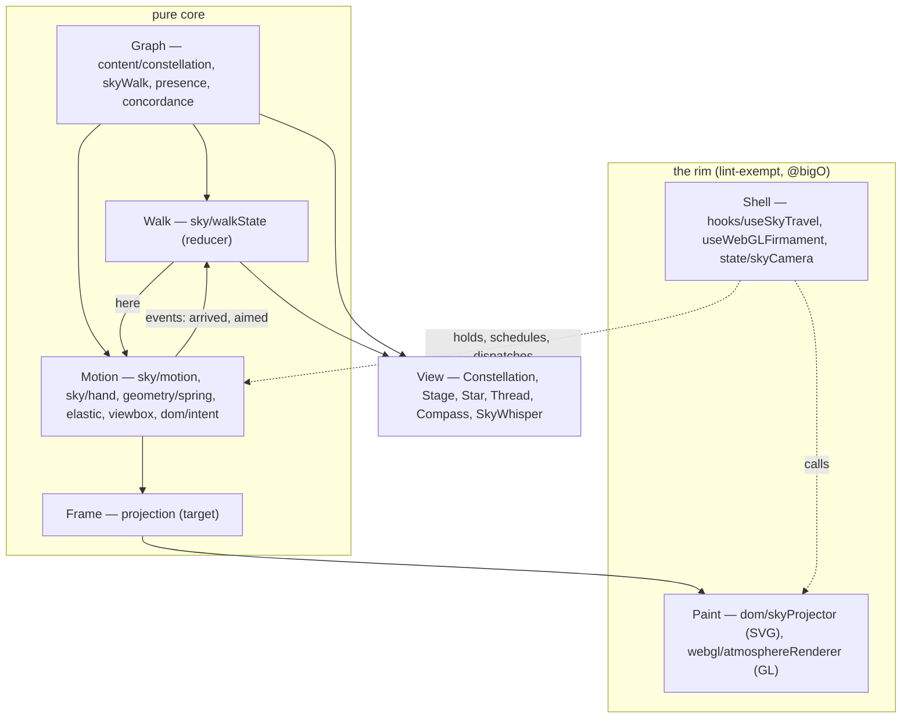

# The Sky's Architecture — A Pure Core in a Thin Shell

*The application architecture the sky grows into when the site's functional discipline is taken all the way: every change to the sky is a function from a state and an input to the next state; the only code that touches the world is a rim thin enough to read in one sitting. Named 2026-09-03, with Danny, after the walk's second week. Downstream of [REACT_NORTH_STAR.md](./REACT_NORTH_STAR.md) (the axioms it applies), [CONSTELLATION_WALK.md](./CONSTELLATION_WALK.md) (the behavior it carries), and [CONSTELLATION_HORIZON.md](./CONSTELLATION_HORIZON.md) (the layers it keeps).*

---

## The Image

A room with a sky drawn on its ceiling. The drawing is data: where each star is, which threads join them, what the visitor stands at, what the hand holds. The drawing changes only by being redrawn from a new description. Nothing in the room reaches up and moves a star; something describes a sky in which the star is elsewhere, and the ceiling is painted again.

That is the whole architecture. Everything below is its consequence.

---

## The Principles

1. **Pure by default.** A function takes values and returns a value. It does not read a clock, a ref, the DOM, or a store; it does not write one. Read in isolation, it tells the whole truth about one transition, and it is tested with two values and an equality.
2. **The rim is named, thin, and justified.** Mutation exists — a reference that holds the current state, an attribute written to an element, a buffer handed to the GPU — and it lives in a few files the lint exemption names one by one. Each carries a `@bigO` note saying why it is there. The exemption is a rim, not a lifestyle.
3. **Time is an argument.** `now` and `dt` are passed in. The core never asks what time it is, so the same transition can be run in a test at any cadence and land in the same place.
4. **Events are data.** A transition that has consequences elsewhere — an arrival, an aim — returns them as values. The shell hands them on. Nothing inside the core calls out.
5. **Two clocks, one boundary.** The render clock (React) owns the discrete: the graph, where the visitor stands, what is hovered, aimed, lit. The frame clock (requestAnimationFrame) owns the continuous: the camera's motion. They meet at a boundary that carries only data — the graph and `here` down, events up.
6. **One frame, two painters.** The projection of the sky onto the screen is computed once and painted twice, once in SVG and once in WebGL. The two skies agree because they are the same frame.
7. **Atomic units, each tested.** A track from here, the hand's offset along it, the elastic remainder, the reticle's choice, one step of a spring, the release decision, the rest distance for a frame. Small, pure, named, tested; composed by the layer above.
8. **The reducer owns the discrete; the shell owns nothing but references and the schedule.** A reducer is where discrete state changes. A shell is where a state is kept, painted, and scheduled. Neither decides what the other does.

---

## The Layers

Six layers, in the order data flows. The first four are pure. The fifth and sixth are the rim.

| Layer | What it holds | Clock | Pure | Lives in |
|---|---|---|---|---|
| **Graph** | The sky as content: stars placed by the compass, figures as spanning trees, the concordance, presence. Built once from the works. | Build | Yes | `content/constellation.ts`, `content/skyWalk.ts`, `content/presence.ts`, `content/concordance.ts` |
| **Walk** | Where the visitor stands, what they have visited and walked, what they attend and aim at. A reducer over events. | Render | Yes | `sky/walkState.ts` (held by `hooks/useSkyWalk.ts`) |
| **Motion** | The camera's continuous state and every transition of it: travel, the hand, the spring, the gaze, the rest distance. Returns events. | Frame | Yes | `sky/motion.ts`, `sky/hand.ts`, `geometry/spring.ts`, `geometry/elastic.ts`, `geometry/viewbox.ts`, `dom/intent.ts`, `dom/labelLayout.ts` |
| **Frame** | The projection: where every star, thread, name, and the companion sit on screen for a motion, and the label layout. | Frame | Yes | *target* — today the projector computes and writes in one pass |
| **Paint** | Writing a frame to the page: SVG attributes, GL uniforms and instance buffers. | Frame | No, exempt | `dom/skyProjector.ts`, `webgl/atmosphereRenderer.ts` |
| **Shell** | The current motion in a ref, the animation-frame schedule, pointer capture, event dispatch to the walk, the WebGL loop's lifetime. | Both | No, exempt | `hooks/useSkyTravel.ts`, `hooks/useWebGLFirmament.ts`, `state/skyCamera.ts` |

Above all of it the **View**: React components that render the structural SVG from the graph and the walk — atoms, molecules, organisms per the North Star — and never touch the frame clock. The travel hook writes the continuous attributes (transforms, positions, the companion's channels) beneath React's notice; React writes the discrete ones (`data-here`, `data-present`, `data-active`, the names).

---

## Motion

The camera's state is one immutable value, `Motion`: where the visitor stands (`anchor`), where the camera's surface point is (`pos`), the gaze, the rest distance, and a `Phase` — `rest`, `travel`, `held` (a `Hand`), or `settle` (a spring). The transitions:

- `advance(motion, now)` — the sky `now`: the phase stepped (a travel glides; a spring is advanced in closed form), the gaze and rest eased, the motion since the last advance measured for the atmosphere's streak. Returns the next motion and its events.
- `travelTo(motion, to, place, now, along, reduced)` — a destination named; returns a `departed` event so the walk can frame it ahead. Under reduced motion, an immediate arrival and no departure.
- `grab`, `moveHand`, `releaseHand` — a hand on the sky (`sky/hand.ts`). The hand's displacement is split into a free component along the track it takes and a remainder at the play; the reticle picks the intent from the projected stars; release settles onto the intent, or the track's star, or home. The hand announces itself: `held` when it engages, `released` when it lets go, and the aim is kept through the settle so the claim never blinks.
- `fitRest`, `lookToward` — the frame and the cursor.
- `arrive` — the one door: the place becomes here and the anchor, the sky rests, an `arrived` event is returned.

Nothing in these files imports React, the DOM, or a clock. `cameraOf(motion)` is the pure function from a motion to a camera; everything that paints reads it.

## The hand

A press `grab`s: the hand is held but not engaged, so a tap stays a tap. Past the threshold the hand engages: the tracks from here are laid out on screen (`tracksFrom`), and each move splits the hand's displacement — free along the track it takes, at `PLAY` elsewhere, one to one within the free zone and banded beyond (`geometry/elastic.ts`). The hand is read in the frame of the camera at rest on the anchor, so the mapping cannot drift as the sky follows. The reticle (`dom/intent.ts`) picks the star nearest the center, in reach, a step along the graph getting a small head start; a change is an `aimed` event. On release the reticle decides; the track's star is a fallback for a hand far along a track with nothing in reach; otherwise the sky springs home (`geometry/spring.ts`, closed form). The graph is a groove, not a rail.

## Walk

`walkReducer(state, event)` folds eight events into where the visitor stands, where they are bound and along which thread, whether a hand holds the sky, what they have visited and walked, what they attend, what the pointer rests on (a star, a thread), and what they aim at: `departed`, `arrived`, `held`, `released` from the core; `attended`, `hovered`, `traced` from the view; `aimed` from the core's reticle. The reducer owns attention — one at a time: a `hovered` or `traced` event is refused while the sky is under way (a heading set, or a hand holding), and `departed` and `held` let go of whatever was hovered, so a star streaming past the pointer never claims and a star pressed at the start of a drag is released when the hand engages. `useSkyWalk` is a `useReducer` around it and one effect that remembers `here` for the session. Every consumer reads the state; the events are the only way it changes.

## The shell

`useSkyTravel` owns exactly what cannot be pure: a ref holding the current motion; the animation-frame schedule and the clock; pointer capture; the paint (through the projector) of each new motion; the dispatch of the core's events to the walk. Every transition it performs is `commit(refs, transition(motion, …))`: a motion in, a motion out, painted, its events handed on. The shell never decides anything.

---

## The Two Clocks

React renders the structural sky from the graph and the walk. It decides which star is here, which are present, which names show, what the whisper says. It knows nothing of where the camera is this frame.

The frame loop moves the camera and writes positions. It knows nothing of React; it reads the graph and `here` as values and returns events.

The boundary is data. Down: the graph and `here` (a change of `here` from outside — a restored place, a look-up jump — is a destination like any other). Up: `departed`, `arrived`, `held`, `released`, and `aimed`, handed on by one `send`. When the hand aims at a star, the walk hears it, React renders the claim, and the frame loop keeps moving the sky underneath. When a travel departs, the walk hears that too, and React frames the destination ahead while the loop carries the sky toward it. Neither clock waits for the other.

*A third clock, apart (2026-09-05).* The daystar's magic — the scarf of silk around the hour's face — runs on GSAP's ticker, in its own lazily fetched chunk (`dom/daystarMagic.ts`, mounted by `hooks/useDaystarMagic.ts` after load and idle). It touches nothing the other two clocks own: it reads no camera, writes no star, and hears no walk event. Its inputs are three moods — the energy the pointer lends, the whirl of the turn, the flow of the silk's colors — set through a handle the molecule holds; its geometry is pure (`sky/scarfGeometry.ts`); its output is four paths, a gradient's turn, and one custom property. It disposes with the molecule. The sky would be whole without it, and is, until it arrives.

---

## What Shipped (2026-09-03, PR #57)

The Motion and Walk layers as described, with no change to what the sky does except the two the walk needed: the track no longer caps the hand at its own star, and the reticle decides at release. The shell shrank from a thousand lines that held physics, gestures, and paint in one mutable bag to a rim that holds a ref and a schedule. The lint exemption lost `useSkyTravel`'s predecessor's reasons and kept `useSkyTravel` only as the shell; `wellPhysics` left the list by becoming pure.

Tests: the spring's closed form against its own fine-stepped integration; a travel arriving exactly once; a settle onto a star arriving and a settle home not; the gaze and rest easing to stillness; the hand taking a track, following at the play off it, aiming at the nearest star, carrying past a neighbor to the third star on the line; the release decision; the reducer's events.

## What Shipped (2026-09-05, the storyboard pass)

The boundary grew from two events to five, and the reducer took ownership of attention (`CONSTELLATION_STORYBOARD.md`). The view's rules for what claims — `attentionKeyOf` for the atmosphere's crescendo, `bodyPlaceOf` for the companion's hue, `litEndsOf` for a traced thread — are pure functions in the organism's `walk.ts`, tested with values. The organism split into a hook that wires the scene (`useSkyScene`) and markup that renders it. The tests added: the reducer's quiet while the sky is under way; `departed` from a travel and its absence under reduced motion; `held` and `released` from the hand and the aim persisting through the settle; the world's derivations; the organism's seams — a hover and a traced thread composing, hover quiet during a crossing with the destination framed ahead, focus moving between stars without a blink, a press that becomes a drag letting go of the pressed star — driven through the DOM with real animation frames.

---

## What Remains — the Whole Way

Named so the next passes are steps on one path, not detours.

- **Frame, then two painters.** `projectFrame(motion, graph, viewport)` returns every screen position and the label layout as data; `paintSvg(frame)` and `paintGl(frame)` write it. The WebGL hook stops re-projecting the stars and replaying the SVG's transform chain; it reads the same frame. The projector's scratch buffers move inside the painters. *Trigger:* the next change that has to be made in two projections at once.
- **Gestures as data.** `gestureOf(event, geometry)` turns a DOM pointer or key event into a `Gesture` value; the shell becomes a switch over gestures. *Trigger:* the first gesture that is hard to test through the DOM.
- **The event log.** `arrived`, `aimed`, `attended`, and one day `proposed` and `blessed` are already values. Kept as a log they are the walk's memory in full, the transparency layer's material ([TRANSPARENCY.md](./TRANSPARENCY.md)), and the generative horizon's seam: a proposal is an event the author blesses ([CONSTELLATION_WALK.md](./CONSTELLATION_WALK.md) §"The Generative Horizon"). *Trigger:* the first proposal.
- **The walk's queries as derived data.** `namedRanks`, `presentFrom`, `bearingsOf` are recomputed on every render; a memoized `WalkView` derived from (graph, walk) would compute each once per change. *Trigger:* the corpus passing a hundred works, or the compiler's memoization proving insufficient.
- **The remaining rim.** `useWebGLFirmament` still holds a mutable loop state with its own easing; the atmosphere's per-star activation and presence belong in the frame. *Trigger:* the frame.

---

## Enforced in Code

- The FP selectors in `eslint.config.js` §"FP discipline" apply to everything in `src/` by default: no mutation methods, no imperative loops, no update or compound assignment, no `delete`, no classes.
- The exemption names the rim: `hooks/useSkyTravel.ts`, `hooks/useThresholdReveal.ts`, `hooks/useWebGLFirmament.ts`, `dom/skyProjector.ts`, `state/constellationCursor.ts`, `state/skyCamera.ts`, `geometry/camera.ts`, `webgl/atmosphereProjection.ts`, `webgl/atmosphereRenderer.ts`. Nothing in `sky/` is on it, and neither is `dom/daystarMagic.ts`: the magic's only mutable state is the moods GSAP tweens in place, and its paths go out through `setAttribute`. A file joins the list with a `@bigO` note or not at all.
- `max-lines-per-function` (80), the component-shape check, and the boundary rules hold as before ([REACT_NORTH_STAR.md](./REACT_NORTH_STAR.md)).

*If this document and the code disagree, the code is the present and this is what it is reaching for. Catch the document up, or catch the code up — but say which.*
