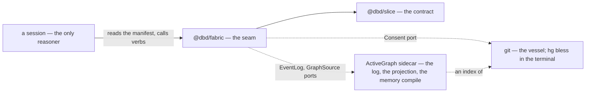

# The Fabric

_The runtime a local agent session lives in, and the ground the six repositories share. Named 2026-09-06, with Danny, from his own phrase for it: a well-permissioned interaction fabric for a local agent, married to memory and to deterministic action scripts the agent feeds structured data. Downstream of [CLAUDE.md](./CLAUDE.md) (the soul), [CATHEDRALS.md](./CATHEDRALS.md) (the workspace, the slice, the consent loop, git as the vessel), [REACT_NORTH_STAR.md](./REACT_NORTH_STAR.md) (the axioms and the FP rim), and [CONSTELLATION_ARCHITECTURE.md](./CONSTELLATION_ARCHITECTURE.md) (a pure core in a thin shell). It sits on the grounds beside the cathedral, and it is the second thing that needs the root._

---

## The Image

Six repositories, one person, one pattern. A research vault for a book about staying the author of what you become. A knowledge-graph engine whose whole constitution is _agents propose; the author blesses_. A December seed that named the three operations both grew from. A Next.js root that carried the longing before the architecture. A QA product built for the day job on the same seams, with the personal vocabulary scrubbed out. And this house. Read together, every one of them is a state machine that can do everything except finish. One person finishes.

The fabric is that pattern, made into a runtime. It is not a seventh project. It is the loom the other six are already woven on, named so that a session can stand in it: an append-only log per tenant, a graph as memory, a manifest of verbs that are themselves blessed nodes, a receipt on every call, and consent as the only way across a wall. The session is the only reasoner. The fabric never thinks. It remembers, it acts deterministically when asked, and it waits.

---

## What Is Received

Nothing here is invented. Each part was built once, elsewhere, and is named with the repository that built it.

| Received                                                                                                                          | From                               | Where it was written                                                                            |
| --------------------------------------------------------------------------------------------------------------------------------- | ---------------------------------- | ----------------------------------------------------------------------------------------------- |
| The append-only log as the source of truth; the graph as its projection; replay by step                                           | the engine, and the seed before it | `cathedrals` `docs/architecture/GRAPH_PROTOCOL.md`; `living-graph` `CONSTITUTION.md` Article VI |
| Consent as a primitive: pending with `decision = NULL`, blessed or rejected by the sovereign, never by the proposer               | the engine                         | `cathedrals` `AGENTS.md`, `manifesto.md` §"the sacred gap"                                      |
| Spaces as ownership boundaries; a change crosses spaces only as a bridge proposal that lands as pending in the target             | the engine                         | `cathedrals` `SPACE_MODEL.md`                                                                   |
| Three origins on every edge: declared, discovered, emergent                                                                       | the engine, the seed               | `@dbd/slice` `ORIGINS`                                                                          |
| The manifest as the contract: a vocabulary generated from code, read once per session, signatures frozen at publication           | the product                        | `agentic-playwright` `AGENTS.md` §"The manifest is the contract"                                |
| A receipt on every reasoning call; every log append-only; provenance minted at the event, never reconstructed                     | the product                        | `agentic-playwright` `AGENTS.md` §"Non-negotiable model"                                        |
| A measurement layer that derives its probes from the manifest and names in advance the boolean at which it stops                  | the product                        | `agentic-playwright` `docs/v2-substrate.md` §7                                                  |
| A reference is a receipt, not the content; every claim names where it came from; the direction of flow is recorded                | the vault                          | `book-research` `CLAUDE.md` §"Posture", §"Sources"                                              |
| The session rhythm: orient, work, persist; friction captured as observations; the apparatus retired when it displaces the writing | the vault                          | `book-research` `CLAUDE.md` §"Session rhythm", §"Known risks"                                   |
| Four actors — author, reader, agent, system — each running pause, sense, respond; structure earned, then blessed                  | the seed                           | `living-graph` `CONSTITUTION.md` §"The Four Actors"                                             |
| The golden loop — state, intervention, action, outcome, reflection — as the shape of what a session leaves behind                 | the root                           | `dyerverse` `TECHNICAL_MANIFESTO.md`                                                            |
| A pure core in a thin shell; time as an argument; events as data; the rim named file by file                                      | the house                          | `CONSTELLATION_ARCHITECTURE.md`                                                                 |
| The wall, the door, and who keeps which keys                                                                                      | the house                          | `CATHEDRALS.md`                                                                                 |

The one thing none of the six wrote is the tenancy rule below, which the record reached on 2026-09-06 in conversation: sovereignty is recursive, and every tenant is sovereign inside its own space.

---

## The Vendor

The memory runtime is not written here. It is vendored, as a model first and as a package second.

**The model is ActiveGraph's**, Yohei Nakajima's event-sourced graph runtime, whose single design decision is the fabric's: _the append-only log is the source of truth and the working graph a deterministic projection of it._ Behaviors react to events and may live on typed edges. Policies decide which mutations require human approval and what the runtime refuses. Around it sit a memory layer that compiles source turns into claims, entities, events, states, preferences, and conflicts, and keeps event time apart from observation time; a pack library whose core carries `memory_candidate` and `evaluation`; an F# artifact of executable laws for when replay, confluence, and fork safety actually hold; and a federated knowledge system whose rules — _agents cannot authorize themselves_; _disclosure precedes public evaluation_ — are this file's tenancy rule, written by someone else. The paper is _The Log is the Agent_ (arXiv 2605.21997).

**The package is Python. The fabric is Effect.** So the runtime sits behind a port. ActiveGraph owns the log store, the projection, and the memory compile, running as a local sidecar the fabric starts with a session and stops with it. The fabric owns the seam: the manifest, the verbs, the receipts, the consent loop, and the surface the session sees. The two speak only in the slice and the event schema, which keeps `CATHEDRALS.md`'s law that the contract is TypeScript and zod and nothing else. If the sidecar boundary proves awkward in one afternoon, the engine's own event store — expected-version append, replay by step, three temporal coordinates on every event — is the same design in Effect, and the port swaps without the fabric noticing.

**Declined: reasoning inside the runtime.** ActiveGraph ships LLM-backed behaviors. The fabric does not use them. The session is the only reasoner; every behavior the sidecar runs is deterministic. This is not a constraint the vendor imposes. It is the whole point: the deterministic action scripts Danny named are exactly the behaviors, and the reasoning stays where a human can kick it off and read it back.

**How the vendor came in (2026-09-06).** Two of its laws first, as code: every event now carries `actor` and `causedBy`, the fields the vendor's record has and the fabric's lacked; and a refused call is an event, `verb.refused`, never an exception. Then the compile, behind the `MemoryCompile` port: `activegraph-memory`, run as a sidecar for one question with its deterministic extractor and no reasoner, turns the reflections a viewer may see into claims and events with event time kept apart from observation time and quantities extracted, and answers as far as it can. Measured against a real drive, the compile is real and the retrieval is not yet: without an embedding provider the vendor's `retrieve` answers "unanswerable from available memory" to every question, and its conflict detection needs a keyed subject the deterministic extractor does not supply. So `recall` reports the compile and the vendor's answer as given, and the ranking comes from elsewhere.

**Resonance is qmd's (Danny, 2026-09-06: "let's add qmd as the embedding provider").** qmd is the vault's own search — a project-local index of markdown folders with local embeddings and no key — and it speaks JSON with a `qmd://<collection>/<path>` URI on every hit. The fabric's node ids are functions of those paths, so a hit maps to a node with nothing guessed. The collections are the sources: the vault's notes, the works, the skills, and the reflections, which the fabric writes out as markdown under `fabric/.memory/` for qmd to read. `slice` ranks by resonance first and by mention after; `recall` lets resonance choose which reflections the compile sees; `reflect` re-embeds only the reflections, as a derive, and `pnpm fabric index` re-embeds every collection, which on a CPU is minutes for the vault. Where no qmd is installed, resonance ranks nothing and the fabric degrades to mention. qmd is itself a Model Context Protocol server, so a session may also speak to it directly; the fabric uses it as a provider.

---

## The Shape

Five layers, in dependency order. Each is data or a pure function until the last, which is the only place an effect is performed.

**The log.** One append-only log per tenant. Every event carries its step in that log, the time it was recorded, and the space it belongs to. The working state — spaces, verbs, receipts, reflections, bridges, references — is a fold over the log, and folding the same log twice yields the same state. Nothing else is ever written. In this repository the log is markdown and JSON in git, per `CATHEDRALS.md` §"Git Is the Vessel"; the sidecar's SQLite is an index of it, rebuilt from it.

**The tenants.** Two spaces from the first day: an operator space and an agent space, each with a sovereign, and each sovereign over itself. Inside its own space a tenant writes without asking. A node moves between spaces only by a bridge proposal, which materializes as pending in the target space and waits for the target's sovereign. A weak reference is the other way across: a citation written onto the relating node, in its own space, pointing at a node across the wall by text — a historical textual citation, resolvable by the fabric and never an edge. The vault's rule for a reference, that it is a receipt and not the content, holds here at the scale of two graphs.

**The sources.** The operator's space is not only what crossed into it. It reads from sources — a vault of claims, a house of works, a folder of skills — each a node in his space, proposed and blessed like a verb, and read only once blessed. Blessing a source is disclosing it: whatever a source holds, a session that may load the space may see. Three adapters read the three kinds, all from markdown with frontmatter and wikilinks, the one shape the vault, the house, and the skills already share, and a composite merges their parts with what was blessed across into one grounded slice. A source whose path is not checked out reads as nothing.

**The self-description.** The system sees itself. From the log and the schema alone, `describe` derives one document — the spaces, the manifest with every verb's JSON Schema, the sources, what is waiting, the closed vocabularies, the event log's own schema as JSON Schema, the invariants, and the protocol — and writes it beside the log as `fabric/manifest.json`, `fabric/events.schema.json`, and a generated `fabric/README.md` for any system that has only that folder. The same three are served as resources (`fabric://manifest`, `fabric://events.schema`, `fabric://readme`). The description's time is the last event's, not the clock's, so the same log describes itself the same way twice, and `describe --check` runs in the lint chain: a description that has drifted from the log fails the build.

**The verbs.** A verb is a node. It carries its input schema and output schema as JSON Schema data, a consequence class, an origin, and the moment it was blessed. The four consequence classes:

| Class     | What a call may do                                             | Where its result lands              |
| --------- | -------------------------------------------------------------- | ----------------------------------- |
| `observe` | read; pure                                                     | the session's context               |
| `derive`  | write to an index or a cache that is recomputable from the log | the sidecar's index                 |
| `propose` | write to pending in some space                                 | the target space's gap              |
| `world`   | act outside the graph — publish, run, send                     | the world, and a receipt in the log |

The manifest is a projection: the verbs of one space that are blessed and not retired, and nothing else. A session reads it once. The agent's tool list is the manifest, verbatim. A `world` verb exists in the collection the same way anything becomes canonical — proposed, then blessed by the operator — and until it is blessed the session cannot see it, let alone call it. A verb's signature is frozen at blessing; a change is a new verb and a retirement.

**The consent port.** The engine's, unchanged: a proposal is pending with a null decision; the target's sovereign resolves it once; the resolution is an event. `resolve` is never a verb. It is the one operation the fabric refuses to put in the manifest, so that no session, however permitted, can bless.

**The five verbs.** `slice` loads a space for one turn, the viewer's own whole or the operator's through its blessed sources, ranked by resonance then mention. `reflect` records what a session noticed and proposes its crossing. `recall` asks memory a question through resonance and the compile. `pending` counts the gap. `sync` reports the siblings' drift.

**The session shell.** A Claude Code or Copilot session, started by a human message or a reply, is the only way the fabric runs. The session starts the fabric as a Model Context Protocol server and ends it. The start hook marks the session and prints its memory into context: the manifest, what is waiting, and the reflections it may see. The stop hook asks for a reflection if none was recorded for the session, and the session answers with `reflect` — a hook can carry a session's id and a refusal, but it cannot author what the session noticed. Between sessions nothing runs, nothing polls, and nothing wakes on its own. Every verb call appends a receipt: the verb, the space, the session, a fingerprint of the input, a fingerprint of the output. The payloads stay in the events that carried them.

```
packages/
├── slice/     @dbd/slice    the contract: what crosses any wall
├── fabric/    @dbd/fabric   the schema, the fold, the manifest, the invariants, the ports
├── sky/       @dbd/sky      the surface
└── hg/        @dbd/hg       the engine (Phase 2 of CATHEDRALS.md)
```



The fabric depends on the slice and on Effect. The slice depends on nothing but TypeScript and zod. Nothing imports the fabric except an adapter at an edge and the server the session starts.

---

## The First Slice: Reflection

The first thing blessed through the fabric is a reflection from the agent, persisted for retrieval. Everything else is one of many ports; this one runs end to end first.

1. The session ends. The stop hook calls `reflect` with structured data, never prose: what was attempted, what was observed, what was inferred, what should change, and citations to the nodes touched.
2. The reflection lands in the agent space. The agent is sovereign there; no blessing.
3. A deterministic behavior compiles it: claims, entities, events with event time kept apart from observation time, conflicts raised against existing claims. This is the vendor's memory compile, unchanged.
4. A bridge proposal offers the compiled claims to the operator space. Pending, with the gap held.
5. Danny blesses in the terminal. One event, one commit.
6. The next session's start hook retrieves blessed claims into its context by structure and resonance.

**The loop pointed at itself.** A reflection's _what should change_ names nodes: a prompt, a skill, a verb, a policy threshold. Each is a node in the operator space, so a change to any of them is a proposal like any other, evaluated against a held-out set before promotion. The memory substrate is the self-improvement pipeline, not a second system beside it. The product's hypothesis receipts and graduation boolean already run this loop in Danny's own code; the vendor's improvement loop runs it under the same gate. ActiveGraph's research agent states the boundary: tuning a threshold _is self-modification through the gate_, and _the inbox is the one place only the human operator exists._

---

## Handshakes

Danny's rule, 2026-09-06: a perfect lossless handshake — two vocabularies meeting with nothing translated between them — is the tell that a key conduit belongs there. The fabric is built along these. Where a translation layer would be needed, that is a seam to draw explicitly, not a conduit to force.

| Conduit                                       | The two sides                                                                                                                                                                     | What crosses without loss                                                                                                                                                                                                                                   |
| --------------------------------------------- | --------------------------------------------------------------------------------------------------------------------------------------------------------------------------------- | ----------------------------------------------------------------------------------------------------------------------------------------------------------------------------------------------------------------------------------------------------------- |
| The manifest as tools                         | zod; JSON Schema; the Model Context Protocol's low-level server                                                                                                                   | `z.toJSONSchema(schema, { io: 'input' })` emits the schema a verb carries as data, and the protocol's `tools/list` takes that document verbatim. The session's tool list is the manifest with nothing in between.                                           |
| The session's identity                        | Claude Code's hooks; `fabric/.session`; every receipt                                                                                                                             | A hook receives `session_id` as JSON on stdin; the start hook writes it down; the server stamps it on every receipt and reflection. One id, three places, no translation.                                                                                   |
| Memory into context                           | The start hook's stdout; the session's context                                                                                                                                    | Whatever the start hook prints is in the session's context. Memory arrives as the last session's letter, not as a tool the session must remember to call.                                                                                                   |
| The reflection gate                           | The stop hook's stdout; the session's turn                                                                                                                                        | `{ "decision": "block", "reason": … }` on the stop hook's stdout is the reason the session keeps going. The gate is one JSON object, and the session answers it with `reflect`.                                                                             |
| Tagged unions on both sides                   | Effect's `Data.tagged` and `catchTag`; zod's `discriminatedUnion`                                                                                                                 | An error is `{ _tag }`; an event is `{ kind }`. Both are closed unions dispatched by one field, and the fold over events is a table indexed by that field.                                                                                                  |
| The log and the vessel                        | JSON Lines; git                                                                                                                                                                   | One event is one line; one session's lines are one commit; the commit is the provenance. `git log` reads the event log without a tool.                                                                                                                      |
| Pins and citations                            | git submodules; weak references                                                                                                                                                   | A submodule pin is a commit hash written in the relating repository — a weak reference by construction. `sync` reads it as one.                                                                                                                             |
| Candidates and bridges                        | ActiveGraph's core pack; the first slice                                                                                                                                          | `memory_candidate`, then `evaluation`, is `reflection.recorded`, then `bridge.proposed`, then a decision. Held until the runtime enters as a tool over the log.                                                                                             |
| The event record                              | ActiveGraph's event; the fabric's event                                                                                                                                           | His `type`, `payload`, `actor`, `caused_by`, `timestamp`, `id` are our `kind`, `payload`, `actor`, `causedBy`, `at`, `step`: dotted namespace to dotted namespace, monotonic id to monotonic step. The last two fields were his before they were ours.      |
| Frames and spaces                             | ActiveGraph's `frame_id`; the fabric's `space`                                                                                                                                    | A behavior filtered to one frame is a verb scoped to one space. Two tenancies, reached independently, one field apart.                                                                                                                                      |
| Approval and blessing                         | ActiveGraph's `propose`, `pending_approvals`, `approve(approved_by)`; the fabric's `propose`, `pending`, `bless`                                                                  | `approval.proposed` to `granted` or `denied` is `bridge.proposed` to `resolved` with `decision` and `by`. Nothing translates.                                                                                                                               |
| Footprint and consequence                     | `agent-runtime-laws`' effect footprint; the fabric's consequence classes                                                                                                          | pure, idempotent, compensatable, one-shot is observe, derive, propose, world with fewer rungs; his finding that fork safety is relative to the footprint is why a world verb needs a receipt first.                                                         |
| The description and the machine-readable docs | `fabric://readme`; ActiveGraph's `/llms.txt`                                                                                                                                      | Both are one generated page a system reads before speaking. Ours is derived from the log, so it cannot say what the log does not.                                                                                                                           |
| Hits and nodes                                | qmd's `qmd://<collection>/<path>`; the fabric's node ids                                                                                                                          | The sources name nodes by path; qmd names hits by path; one function maps the second to the first. Resonance arrives with nothing guessed.                                                                                                                  |
| Patches and self-improvement                  | ActiveGraph's `patch.proposed`, `applied`, `rejected` on prompt and policy nodes; the fabric's `patch.proposed`, `evaluated`, `resolved` on prompt, skill, verb, and policy nodes | His loop changes the runtime's own nodes through the approval lifecycle; ours changes the operator's through blessing. Same three states, one event kind apart for the evaluation, which he runs inside the reasoner and we run inside the lints.           |
| Hypotheses and outcomes                       | Tesseract's hypothesis receipts and `metric-hypothesis-confirmation-rate`; the fabric's `hypothesis` on a patch and `outcomes` on a reflection                                    | A change states in advance what would confirm it; a later run reports whether it did; the rate over a window against a floor stated in advance is graduation. The workshop's discipline is the loop's discipline, with the agent's next session as the run. |
| The base and the pin                          | git's content hash; a patch's `baseFingerprint`                                                                                                                                   | A patch names the text it was read against by fingerprint, and applies only if the text is still that text. Optimistic concurrency, in the vessel's own currency.                                                                                           |

---

## Invariants

Each carries an id in the engine's ledger style and a test in `packages/fabric/src/fabric.test.ts`.

- **INV-FAB-001 — a call is to a verb in the manifest.** A receipt names a verb that is blessed and not retired. The manifest projection enforces the first half; the invariant check reports the second.
- **INV-FAB-002 — a verb or a source is blessed by the sovereign of its space.** A bless or retire event whose `by` is not the space's sovereign is reported. A bless for a verb or a source never proposed is reported and ignored by the fold.
- **INV-FAB-003 — a bridge crosses a wall and is closed once, by the target's sovereign.** `from` and `to` differ; the first resolution wins; a resolution by anyone but the target's sovereign is reported.
- **INV-FAB-004 — a weak reference crosses a wall as text.** It lives on the citing node, in the citing space, and points to another space. Inside one space a relation is an edge, not a reference.
- **INV-FAB-005 — the fold is a function.** Projecting the same log yields the same state, and the state survives the round trip through JSON. The only write is an append.
- **INV-FAB-006 — a tenant sees its own space whole and the other space through blessing.** Inside its own space a session retrieves everything it recorded. Across the wall it retrieves only what a bridge carried over and the sovereign blessed. Private evidence never leaks through retrieval.
- **INV-FAB-007 — a signature is frozen at blessing.** Before a call, the schema the code would parse with is compared to the schema the blessed verb carries; a difference refuses the call. A change is a new verb and a retirement.
- **INV-FAB-008 — a patch is applied only to the base it was proposed against, only by the sovereign, and once.** A patch names its base by fingerprint; `bless` applies it only if the node's fingerprint is still that, and records whether it did; a resolution by anyone but the space's sovereign is reported; the first resolution wins. A patch whose base moved stays waiting until it is rejected or superseded.
- **INV-FAB-009 — an outcome cites a patch that was applied.** `reflect` refuses an outcome on a patch that is not applied, and the invariant check reports one that reached the log anyway. The loop measures only what it changed.

Two declinations are properties rather than checks, and they are stated so a later file cannot quietly reverse them: **the fabric does not reason**, and **`resolve` is not a verb.**

---

## The Workspace

Danny's direction is a modern monorepo. `CATHEDRALS.md` already decided the shape — a pnpm workspace that grows by packages, the site moving under `apps/` when something else needs the root — and this file is the something else. Two adjustments follow from the fabric's own rule.

**Sovereignty is recursive at the scale of repositories.** Each of the six repositories has its own agents, its own hooks, its own commit rhythm, and its own sovereign session. The vault auto-commits on a session hook; the product merges through a human gate; the engine's history is its provenance. Folding them into one history by subtree would make one sovereign of six. So the siblings that stay alive stay in their own repositories, and the workspace holds them as **git submodules**: a pinned commit, which is exactly a weak reference — a citation by hash to a node in another space, written on the relating node. Subtree remains the right verb for the engine alone, as `CATHEDRALS.md` Phase 2 decided, because the engine is meant to become a package of this workspace rather than a sibling of it; that decision stands.

**Playing nice from afar** is one verb. `sync` is an `observe` verb that fetches each submodule's remote, reports the drift between the pinned commit and the sibling's default branch, and lists what changed in the files the fabric reads. Advancing a pin is a `propose` verb: it opens a pull request against the workspace, which is a bridge proposal in the sense above, and Danny blesses it by merging. No pin moves on its own. The vault's cache-marker discipline applies: a pin is re-stamped by a reread of what moved, never by a bare bump.

The submodule arrangement also answers the held question of the workspace's visibility. A submodule pointer publishes a URL and a hash; the content stays in the private repository. The public house can hold the private siblings by reference without publishing a line of them, and the intimate documents `CATHEDRALS.md` names never leave home.

| Sibling              | Role in the fabric                                                             | Enters as                                                     |
| -------------------- | ------------------------------------------------------------------------------ | ------------------------------------------------------------- |
| `cathedrals`         | the engine; the consent loop; the vault of claims about itself                 | subtree, `packages/hg` (`CATHEDRALS.md` Phase 2)              |
| `book-research`      | the operator's deepest memory; the reading queue; the poems beneath everything | submodule, read through a `GraphSource` adapter               |
| `living-graph`       | the seed; lineage; the canvas editor as the source of authoring verbs          | submodule under `lineage/`                                    |
| `dyerverse`          | the root; lineage; the golden loop the reflection descends from                | submodule under `lineage/`                                    |
| `agentic-playwright` | the product; the manifest and receipt patterns; the workshop's graduation loop | submodule, cited; its patterns ported by hand, never imported |
| `website`            | the house; the workspace root until Phase 4                                    | the root                                                      |

Which of these enter, and when, waits on Danny's word about visibility, exactly as `CATHEDRALS.md` holds it.

---

## The Sequence

Phases in pull order. Each names its pull, its scope, its exit, and what stays held.

### Phase 0 — The seam (now)

- **Pull:** Danny said lock it in, 2026-09-06.
- **Scope:** This document. `@dbd/fabric`: the vocabularies, the schema of record, the fold, the manifest projection, the invariants and their tests, the three ports with an in-memory adapter and consent over any log. The workspace aliases and the FP rim extended over the package.
- **Exit:** Typecheck, lint, and tests green. Nothing visible changes.
- **Held:** The package name, `@dbd/fabric`, until Danny blesses it. Every name in this file is a candidate.

### Phase 1 — The session shell (shipped 2026-09-06)

- **Pull:** Danny said keep going; he wants to model how the agent lives inside this.
- **Scope:** The server, over stdio, listing the manifest as tools and appending a receipt per call. The start hook, `orient`, marking the session and printing its memory. The stop hook, `stop-check`, asking once for a reflection. The log as JSON lines at `fabric/spaces/<space>.jsonl`. The sovereign's terminal: `init`, `bless`, `reject`, `pending`, `log`. The four verbs, proposed into the operator's space by `init` and waiting there, unblessed.
- **Exit, met:** Driven end to end over the in-memory log in the tests, and over the file log in a scratch copy — blessed, reflected, crossed, and remembered by the next session from the log alone.
- **Held:** The sidecar. The fold runs in process until the boundary is spiked. The verbs in this repository wait for Danny's blessing; until then the manifest is empty and the start hook says so.

### Phase 2 — The vendors behind the ports (shipped in part, 2026-09-06)

- **Pull:** Danny asked for a massive slice toward fluency for any other system, and named qmd as the embedding provider.
- **Scope, shipped:** The two laws as code (`actor` and `causedBy`; refusals as events). The self-description, its three files, the drift check in lint, and the resources. Sources for the operator's space with three adapters and a composite. The compile as a sidecar behind `MemoryCompile`, deterministic, with the vendor's answer reported as given. qmd behind `Resonance`, ranking `slice` and choosing what `recall` compiles, refreshed by `reflect` and by `pnpm fabric index`.
- **Exit, met:** Driven end to end in a scratch copy with both vendors installed: reflections written, embedded, and found by meaning; the vault's claims sliced into the operator's space by resonance; the compile's claims and quantities returned for a question.
- **Held:** The runtime as a tool over the log (`inspect`, `diff`, `fork`), which the log's event shape now maps to losslessly. Conflicts keyed by subject, which need either the vendor's reasoner or the fabric naming subjects at reflect time. The vendor's own retrieval, once an embedding provider is wired into it rather than beside it.

### Phase 3 — The second tenant

- **Pull:** The first reflection that should cross into the operator space.
- **Scope:** The agent space opened; the bridge proposal on `reflect`; `hg bless` resolving it; the retrieval filter live. Weak references written on reflections that cite the vault.
- **Exit:** A blessed reflection appears in an operator session; an unblessed one does not.

### Phase 4 — The workspace

- **Pull:** Danny's word on visibility and on which siblings enter.
- **Scope:** Submodules under `lineage/` and beside `packages/`; the `sync` verb over them; the site moves under `apps/` per `CATHEDRALS.md` Phase 4.
- **Exit:** `sync` reports drift for every sibling, and no pin has moved without a pull request.

### Phase 5 — The loop pointed at itself

- **Pull:** A reflection whose _what should change_ names a skill or a verb, and Danny wants to bless the change rather than make it by hand.
- **Scope:** Change requests as bridge proposals against prompt, skill, verb, and policy nodes; a held-out evaluation before promotion; the graduation boolean stated in advance.
- **Exit:** One change to a skill lands through the gate, with its receipt and its evaluation in the log.
- **Shipped, 2026-09-06:** the mechanism, waiting on the first real patch for its exit. A patch is a node's whole new text against the base it was read at, with _because_ and a _hypothesis_ the next session can check. `propose` reads the base through the canon port, appends `patch.proposed` into the operator's space, and appends the fabric's own `patch.evaluated` — base unchanged, body differs, frontmatter parses, `markdownlint-cli2` and `cspell` pass on a scratch copy — before Danny sees it. `pnpm fabric pending` shows the patch as a diff with its checks; `pnpm fabric bless patch/<id>` applies it to the canon only if the base still matches, then records `patch.resolved` with `applied`; `reject` keeps it as data. `orient` shows the next session every applied patch nobody has measured, with its hypothesis, and that session reports through `reflect.outcomes` as `confirmed` or `contradicted`, which lands as `patch.outcome`. Graduation is `{ floor: 0.5, window: 5 }`, computed in `describe` and printed in `fabric/README.md`; it gates nothing. The evaluation is the fabric's checks rather than a held-out fork of the runtime: a change to a skill has no test set, so what can be verified without a reasoner is verified, and the hypothesis carries the rest to the next session. Today the canon holds the skills under the blessed skills source, found by frontmatter name; prompt, verb, and policy nodes are targets the schema admits and the canon does not yet hold.

---

## Held

- **The names.** `@dbd/fabric`; the verb names; the path of the log in git. Trigger: Danny's word.
- **The log's path.** `fabric/spaces/<space>.jsonl` in this repository is where Phase 1 put it; the name is a candidate, and it may move to the engine's repository once it enters. Trigger: Danny's word, or Phase 2.
- **Conflicts.** The compile names none until claims carry a subject; `reflect` could ask for one. Trigger: the first two reflections that disagree.
- **The runtime over the log.** Mirroring the log into an ActiveGraph run for `inspect`, `diff`, and `fork`. Trigger: a patch whose evaluation needs a fork of the runtime rather than the lints — a verb or a policy node, once the canon holds one.
- **The canon beyond skills.** Prompt, verb, and policy nodes as text a patch may change. A verb's text is its schema and its program, which is code; a policy node does not exist yet. Trigger: the first `propose` refused for naming one.
- **Refusal receipts.** A refusal is an event now; whether it also earns a receipt id. Trigger: the first world verb.
- **World verbs.** None are proposed here. The first will name itself when a session wants to do something the graph cannot hold. Trigger: the first ask.
- **Copilot as the session.** The hooks are written for Claude Code first. Copilot's equivalent surface is held until a session runs there. Trigger: Danny opens one.
- **The submodule set.** Which siblings enter, under which visibility. Trigger: Danny's word, before Phase 4.

---

## What This File Does Not Govern

- The slice and its invariants: `CATHEDRALS.md` §"The Contract: The Slice".
- The engine's constitution, decisions, and protocol: its own `docs/`, cited and never rewritten.
- The vault's methodology: its own `CLAUDE.md`.
- How the sky draws what the fabric holds: `CONSTELLATION_WALK.md`, `CONSTELLATION_ARCHITECTURE.md`.
- How HTML reaches the browser and when that stance flips: `RENDERING_STRATEGY.md`. The fabric never runs in the page.

---

## Enforced in Code

Today:

- `@dbd/fabric` at [packages/fabric/src/index.ts](./packages/fabric/src/index.ts): the closed vocabularies (consequence classes, space kinds, decisions, change targets), the schema of record for spaces, verbs, receipts, reflections, bridges, weak references, and the nine event kinds; `project` and `apply` as the fold; `manifestFor` and `toolsFrom` as the projection; `fabricIssues` as the invariant check; `EventLog`, `GraphSource`, and `Consent` as Effect tags with an in-memory log and consent over any log.
- The tests at [packages/fabric/src/fabric.test.ts](./packages/fabric/src/fabric.test.ts) hold INV-FAB-001 through INV-FAB-006 and the six-step slice over the in-memory adapter; [packages/fabric/src/shell.test.ts](./packages/fabric/src/shell.test.ts) holds INV-FAB-007, the manifest as tools, a session's reflect-slice-pending-bless-slice over the shared runtime, the grounded memory slice, the file log's per-tenant steps, and the two small handshakes.
- The verbs at [packages/fabric/src/verbs.ts](./packages/fabric/src/verbs.ts): `slice`, `reflect`, `propose`, `recall`, `pending`, `sync`, each a zod schema, a JSON Schema emitted from it, and an Effect program that may fail with a named reason; `refusal` as the gate a call passes; `decidePatch` as the operator's answer, never a verb; the `Canon` port with the on-disk skills behind it at [packages/fabric/src/node/canon.ts](./packages/fabric/src/node/canon.ts).
- The loop at [packages/fabric/src/loop.test.ts](./packages/fabric/src/loop.test.ts): the line diff at [packages/fabric/src/diff.ts](./packages/fabric/src/diff.ts) (the longest common subsequence as a dynamic program, walked back into hunks), a patch proposed against its base and evaluated, INV-FAB-008 and INV-FAB-009, the base that moved, an outcome only on an applied patch, graduation over a window, and the canon on disk finding a skill by its frontmatter name and applying once.
- The memory slice at [packages/fabric/src/graph.ts](./packages/fabric/src/graph.ts); the rim at `packages/fabric/src/node/`: the JSON-lines log, the fingerprint, the siblings through git.
- The shell at [packages/fabric/src/server.ts](./packages/fabric/src/server.ts) and the terminal and hooks at [packages/fabric/src/cli.ts](./packages/fabric/src/cli.ts); `.mcp.json` starts the server for a session; `.claude/settings.json` binds `orient` to session start and `stop-check` to stop; `pnpm fabric` is the operator's command.
- The sources at [packages/fabric/src/node/sources.ts](./packages/fabric/src/node/sources.ts) and the composite at [packages/fabric/src/node/graph-source.ts](./packages/fabric/src/node/graph-source.ts); the self-description at [packages/fabric/src/describe.ts](./packages/fabric/src/describe.ts), written to `fabric/manifest.json`, `fabric/events.schema.json`, and `fabric/README.md` by `pnpm fabric describe` and checked by `pnpm lint:fabric`; the compile sidecar at [packages/fabric/sidecar/memory.py](./packages/fabric/sidecar/memory.py) behind [packages/fabric/src/node/compile.ts](./packages/fabric/src/node/compile.ts); qmd behind [packages/fabric/src/node/qmd.ts](./packages/fabric/src/node/qmd.ts). [packages/fabric/src/slice.test.ts](./packages/fabric/src/slice.test.ts) holds refusals as events, the description's determinism, the adapters over fixtures, merging and cutting, and the vendor handshakes.
- The log at `fabric/spaces/`: two spaces opened, six verbs and three sources proposed, none blessed.
- The workspace: the fabric is its own TypeScript project with node types (`packages/fabric/tsconfig.json`), checked by `pnpm typecheck` and the pre-commit hook; the `@dbd/fabric` alias in `vite.config.ts` and `vitest.config.ts`; the FP rim extended over `packages/fabric/src` in `eslint.config.js`.

Not yet: the runtime over the log; Phase 4's submodules; Copilot's hook surface. The vendors run only where they are installed: `pip install "git+https://github.com/yoheinakajima/activegraph-memory"` into the interpreter `FABRIC_PYTHON` names, and `npm install -g @tobilu/qmd`; absent either, the fabric degrades to the fold and says so.

---

## Dependencies

**This spec depends on:** `CLAUDE.md`, `CATHEDRALS.md`, `REACT_NORTH_STAR.md`, `CONSTELLATION_ARCHITECTURE.md`, `RENDERING_STRATEGY.md`; in the engine's repository, `AGENTS.md`, `docs/architecture/GRAPH_PROTOCOL.md`, `docs/architecture/SPACE_MODEL.md`; in the product's repository, `AGENTS.md`, `docs/v2-substrate.md`; in the vault, `CLAUDE.md`; in the seed, `CONSTITUTION.md`; in the root, `TECHNICAL_MANIFESTO.md`.

**This spec is depended on by:** `BACKLOG.md`, which holds the phases with their triggers; `CATHEDRALS.md` §"The Shape", which names the package; `AGENTS.md`, whose directives cite it.
